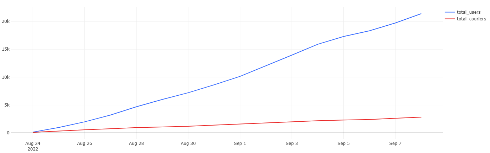
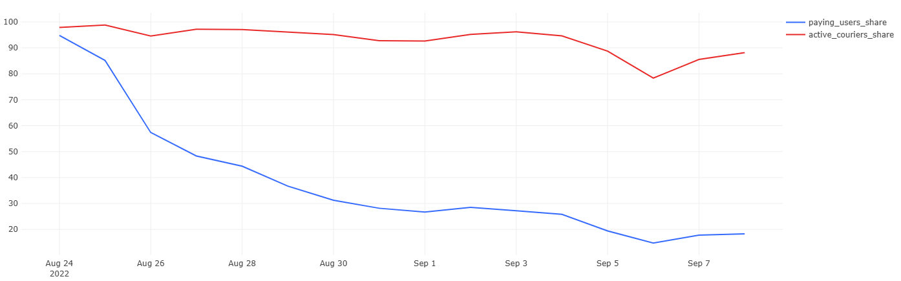

# Courier Service Analytics

This portfolio project contains a series of SQL-based analytical cases exploring operational, product, and marketing performance of a courier delivery service.  
All analysis and dashboards were built in **Redash** using real-like datasets.

---

## Project Overview

The goal of this repository is to demonstrate practical analytical skills across three key domains:
- **Operational Analytics** — user/courier growth, order dynamics, efficiency metrics.
- **Product Analytics** — revenue structure, margins, and retention.
- **Marketing Analytics** — campaign performance, CAC, ROI, and cohort behavior.

### Tools Used
- **SQL (PostgreSQL syntax)** for data analysis  
- **Redash** for query execution and visualization  
- **CSV datasets** raw and aggregated input data

---

## Repository Structure

| Folder | Description |
|---------|-------------|
| `data/` | Raw input datasets (users, couriers, orders, products, actions) |
| `analysis/operational_metrics/` | SQL tasks, results, and dashboards for operational analysis |
| `analysis/product_economics_metrics/` | SQL tasks, results, and dashboards for product-level economic metrics |
| `analysis/marketing_metrics/` | Marketing performance — CAC, ROI, campaign analysis |

Each analysis folder includes:
- `query.sql` — the SQL query used  
- `result.csv` — query output  
- `.png` — Redash dashboard visualizing key metrics
- `README.md` — task description, metrics, insights, and visuals

---

## Analytical Tasks

### Operational Metrics
| # | Task | Focus |
|---|------|--------|
| 1 | [Users and couriers growth](analysis/operational_metrics/01_users_and_couriers_growth/) | Growth of users and couriers over time |
| 2 | [Relative growth rates](analysis/operational_metrics/02_relative_growth_rates/) | Daily percentage growth of new and total users/couriers |
| 3 | [Active users and couriers share](analysis/operational_metrics/03_active_users_and_couriers_share/) | Share of paying users and active couriers |
| 4 | [Single vs multiple orders](analysis/operational_metrics/04_users_with_single_vs_multiple_orders/) | Distribution of users by number of orders per day |
| 5 | [Order dynamics](analysis/operational_metrics/05_order_dynamics/) | Total, first-time, and new-user orders |
| 6 | [Courier workload](analysis/operational_metrics/06_courier_workload/) | Orders and users per active courier |
| 7 | [Average delivery time](analysis/operational_metrics/07_average_delivery_time/) | Average delivery duration (minutes) |
| 8 | [Hourly load & cancel rate](analysis/operational_metrics/08_hourly_load_and_cancel_rate/) | Orders and cancellations by hour |

### Product Economics Metrics
| # | Task | Focus |
|---|------|--------|
| 1 | [Revenue and cumulative growth](analysis/product_economics_metrics/01_revenue_and_cumulative_growth/) | Daily and cumulative product revenue dynamics |
| 2 | [Average order value](analysis/product_economics_metrics/02_average_order_value/) | Average order revenue and its trend |
| 3 | [Repeat purchase rate](analysis/product_economics_metrics/03_repeat_purchase_rate/) | Frequency of repeat user orders |
| 4 | [User retention rate](analysis/product_economics_metrics/04_user_retention_rate/) | Retained users by cohort and time period |
| 5 | [Revenue per user](analysis/product_economics_metrics/05_revenue_per_user/) | ARPU and monetization structure |
| 6 | [Order cancellation loss](analysis/product_economics_metrics/06_order_cancellation_loss/) | Estimated lost revenue due to cancellations |
| 7 | [Profit and margin analysis](analysis/product_economics_metrics/07_profit_and_margin_analysis/) | Profit calculation and margin trends |

### Marketing Metrics
| # | Task | Focus |
|---|------|--------|
| 1 | [Customer acquisition cost(сас)](analysis/marketing_metrics/01_customer_acquisition_cost(сас)/) | Cost efficiency of user acquisition per campaign |
| 2 | [Return on investment(roi)](analysis/marketing_metrics/02_return_on_investment(roi)/) | Profitability and return on advertising spend |
| 3 | [Average check by campaign](analysis/marketing_metrics/03_average_check_by_campaign/) | Average order value comparison between campaigns |
| 4 | [User Retention](analysis/marketing_metrics/04_user_retention/) | Daily retention rates and cohort analysis |
| 5 | [Campaign Cohorts](analysis/marketing_metrics/05_campaign_cohorts/) | Retention analysis for each marketing campaign |
| 6 | [Order cancellation loss](analysis/marketing_metrics/06_order_cancellation_loss/) | Estimated lost revenue due to cancellations |
| 7 | [Cumulative arppu vs cac](analysis/marketing_metrics/06_cumulative_arppu_vs_cac/) | Payback period and revenue per user vs acquisition cost |

---

## Example Dashboards

| Metric | Example |
|---------|----------|
| User and courier growth |  |
| Active user share |  |
| Revenue |  |

---

## Key Insights

- User growth outpaces courier growth, indicating strong demand.
- Product margins vary across segments but show positive retention trends.
- Marketing ROI highlights clear performance differences between campaigns. 

---

**Contact:**  
**Angelina Martynova** 
[angelinaangelina531@gmail.com]
[]
