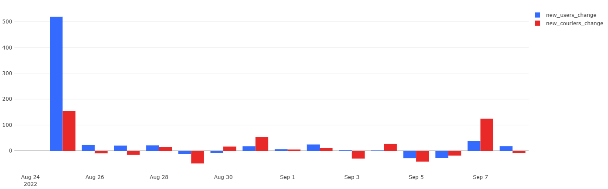
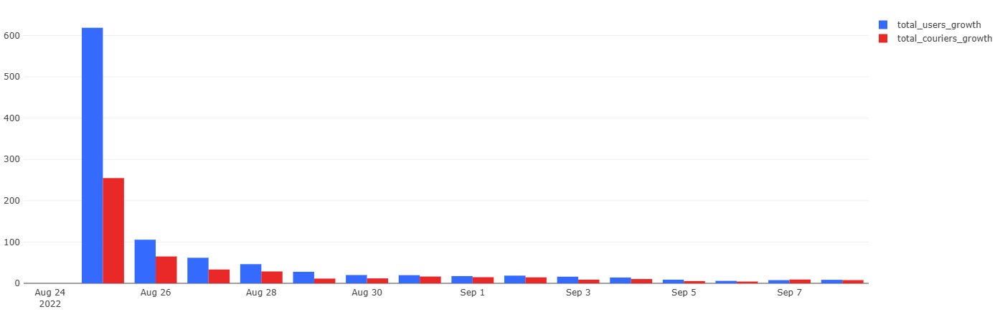

# 02 — Relative Growth Rates

### Goal
Calculate daily growth rates (percentage change) for users and couriers to compare their relative dynamics.

### Metrics
- `new_users_change`, `new_couriers_change` — daily % change in new users/couriers  
- `total_users_growth`, `total_couriers_growth` — daily % growth in totals  

### Insights
- User growth rate fluctuates more sharply than courier growth.  
- Overall, growth rates decrease over time, showing stabilization.  

### Visualizations
- Relative growth of new users vs. couriers  
- Relative growth of total users vs. couriers

