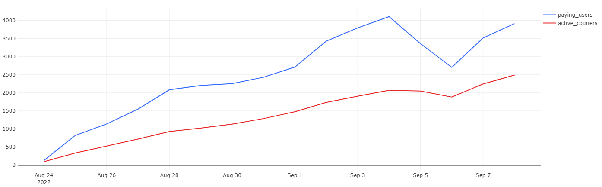
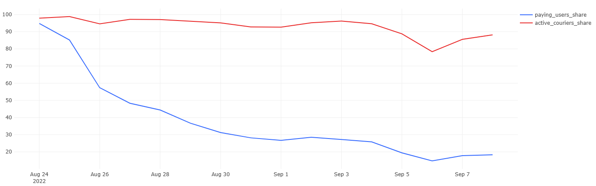

# 03 — Active Users and Couriers Share

### Goal
Measure how many users and couriers are active (performing paid or delivery actions) each day and their share of total.

### Metrics
- `paying_users`, `active_couriers` — absolute daily counts  
- `paying_users_share`, `active_couriers_share` — % of total users/couriers  

### Insights
- Active user and courier counts grow with total base.  
- Shares remain stable over time — activity scales proportionally.  

### Visualizations
- Daily active users and couriers  
- Share of active users and couriers (%)

