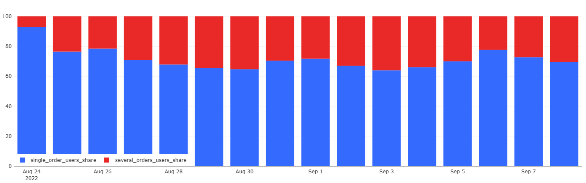

# 04 — Users with Single vs Multiple Orders

### Goal
Identify the share of paying users who made one order versus several orders per day.

### Metrics
- `single_order_users_share` — % of users with one order  
- `several_orders_users_share` — % of users with multiple orders  

### Insights
- Most paying users make a single order per day.  
- Multiple-order users form a small but consistent segment (~5–10%).  

### Visualization
Stacked bar chart showing share of one-order vs multi-order users.

