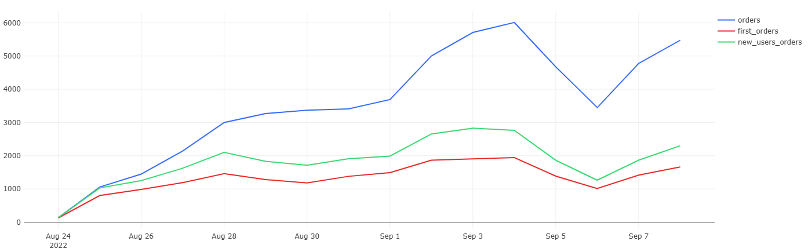
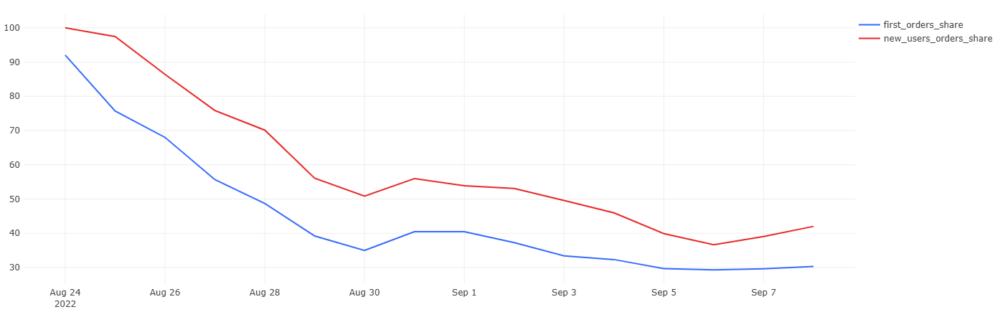

# 05 — Order Dynamics

### Goal
Explore order-related metrics: total orders, first orders, and new-user orders, as well as their relative shares.

### Metrics
- `orders` — total orders per day  
- `first_orders` — users’ first-ever orders  
- `new_users_orders` — orders by new users on signup day  
- `first_orders_share`, `new_users_orders_share` — % of total orders  

### Insights
- As total orders increase, both first and new-user orders grow proportionally.  
- The share of first orders gradually decreases — a sign of retention and maturing user base.  

### Visualizations
- Daily total, first, and new-user orders  
- Share of first and new-user orders

