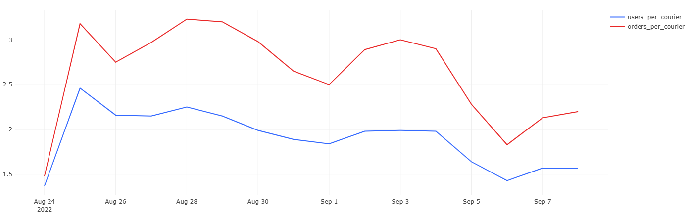

# 06 — Courier Workload

### Goal
Estimate the average workload per active courier.

### Metrics
- `users_per_courier` — paying users per active courier  
- `orders_per_courier` — orders per active courier  

### Insights
- Courier workload stabilizes as courier count grows.  
- Users per courier trend downward — indicating better load distribution.  

### Visualization
Line chart showing average users and orders per courier.

