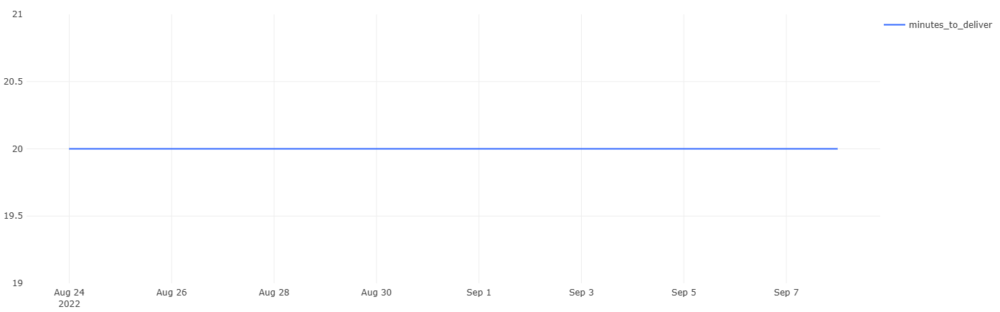

# 07 — Average Delivery Time

### Goal
Calculate average delivery duration in minutes for completed orders.

### Metrics
- `minutes_to_deliver` — average delivery time (minutes)  

### Insights
- Average delivery time stays around 35–40 minutes.  
- Slight spikes may indicate peak-hour congestion or logistics delays.  

### Visualization
Line chart showing daily average delivery time.

