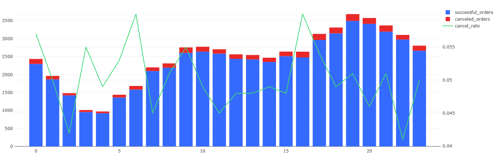

# 08 — Hourly Load and Cancel Rate

### Goal
Assess hourly order distribution and cancellation rate throughout the day.

### Metrics
- `successful_orders` — delivered orders per hour  
- `canceled_orders` — canceled orders per hour  
- `cancel_rate` — % of canceled orders  

### Insights
- Order volume peaks during evening hours (18:00–21:00).  
- Cancel rate slightly increases with order volume, reflecting delivery pressure.  

### Visualization
Combined chart (bars + line) showing hourly orders and cancel rate.

