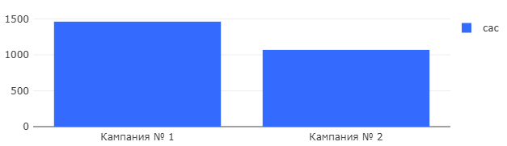

# 01 — Customer Acquisition Cost (CAC)

### Goal
Calculate cost per acquired paying user for each marketing campaign to evaluate acquisition efficiency.

### Metrics
- `cac` — customer acquisition cost per paying user
- `ads_campaign` — marketing campaign identifier
- `count_paying_users` — number of paying users per campaign

### Insights
- Campaign #1 has higher CAC (1461.99) compared to Campaign #2 (1068.38)
- Campaign #2 attracted more users for the same budget
- Higher CAC doesn't necessarily indicate worse performance

### Visualizations
- CAC comparison between campaigns
- Cost efficiency analysis
- Paying users vs acquisition cost

