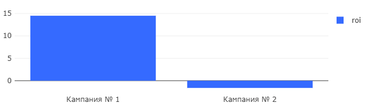

# 02 — Return on Investment (ROI)

### Goal
Calculate return on investment for each marketing campaign to assess profitability.

### Metrics
- `roi` — return on investment percentage
- `ads_campaign` — marketing campaign identifier
- `revenue` — total revenue generated by campaign users
- `ad_spend` — advertising costs (250,000 per campaign)

### Insights
- Campaign #1 shows positive ROI (14.5%)
- Campaign #2 has negative ROI (-1.61%)
- Despite higher CAC, Campaign #1 is more profitable
- Quality of acquired users matters more than quantity

### Visualizations
- ROI comparison between campaigns
- Revenue vs ad spend analysis
- Profitability trends

