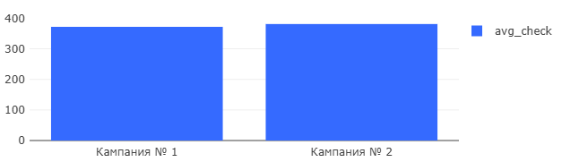

# 03 — Average Check by Campaign

### Goal
Calculate average order value for users from each marketing campaign during their first week.

### Metrics
- `avg_check` — average order value per user
- `ads_campaign` — marketing campaign identifier
- `user_avg_check` — individual user's average order value

### Insights
- Campaign #2 has slightly higher average check (380.88)
- Campaign #1 average check is 371.73
- Difference in average check is not significant
- Higher average check doesn't guarantee better ROI

### Visualizations
- Average check comparison
- User spending patterns
- Order value distribution

