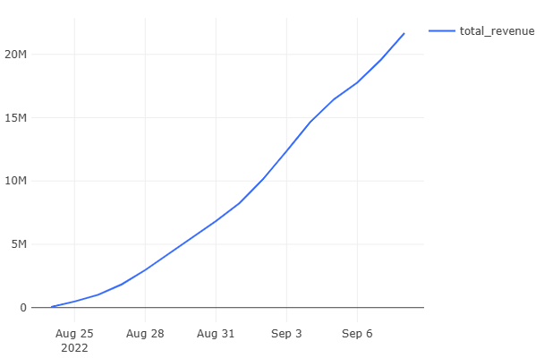

# 01 — Revenue and Cumulative Growth

### Goal
Calculate key revenue metrics to understand daily financial performance and growth trends of the courier service.

### Metrics
- `revenue` — daily revenue from successful orders
- `total_revenue` — cumulative revenue up to the current day
- `revenue_change` — day-over-day revenue growth rate (%)

### Insights
- Significant revenue drops observed on specific days
- Overall positive revenue growth trend with periodic fluctuations
- Peak revenue days correlate with high user activity periods

### Visualizations
- Daily revenue dynamics
- Cumulative revenue growth
- Revenue change percentage

