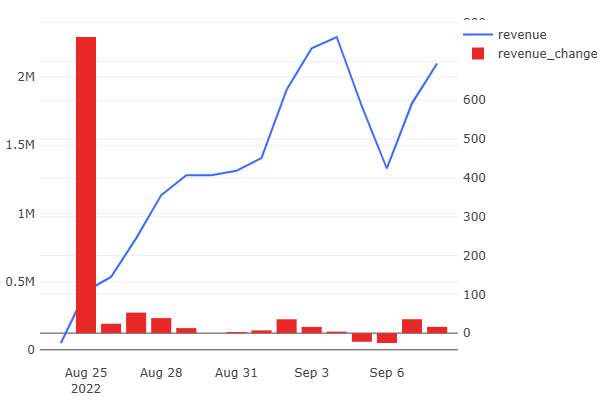

# 01 — Revenue and Cumulative Growth

### Goal
Calculate the total daily revenue, cumulative revenue over time, and day-over-day growth rate to evaluate business performance.

### Metrics
- `daily_revenue` — total product revenue per day  
- `cumulative_revenue` — cumulative total revenue since start  
- `revenue_growth_percent` — daily revenue growth (% vs previous day)

### Insights
- Steady revenue increase indicates healthy order volume growth.  
- Negative day-over-day rates may highlight weekends or low-demand periods.  
- Useful for identifying trends and forecasting future performance.

### Visualization
Line chart with two series:
- Daily Revenue  
- Cumulative Revenue

