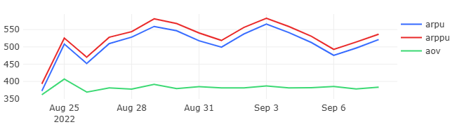

# 02 — Average Order Value

### Goal
Analyze average revenue metrics per user and per order to understand customer value and spending patterns.

### Metrics
- `arpu` — Average Revenue Per User (all users)
- `arppu` — Average Revenue Per Paying User
- `aov` — Average Order Value

### Insights
- ARPPU consistently higher than ARPU, indicating paying users spend significantly more
- AOV shows moderate fluctuations but remains relatively stable
- ARPU has wider variance due to inclusion of all registered users

### Visualizations
- ARPU, ARPPU, and AOV daily trends
- Comparison of user value metrics

