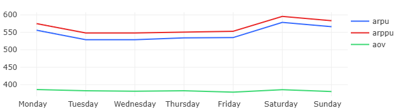

# 04 — User Retention Rate

### Goal
Identify weekly patterns in user behavior and revenue metrics across different days of the week.

### Metrics
- `arpu` — Average Revenue Per User by weekday
- `arppu` — Average Revenue Per Paying User by weekday
- `aov` — Average Order Value by weekday

### Insights
- Highest ARPU and ARPPU values observed on weekends
- AOV remains consistent throughout the week
- Mid-week shows lower user engagement metrics

### Visualizations
- Weekly ARPU, ARPPU, and AOV patterns
- Day-of-week performance comparison

