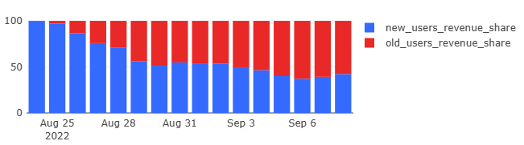

# 05 — Revenue per User

### Goal
Segment revenue between new and existing users to understand acquisition effectiveness and customer loyalty.

### Metrics
- `revenue` — total daily revenue
- `new_users_revenue` — revenue from first-time users
- `new_users_revenue_share` — percentage of revenue from new users
- `old_users_revenue_share` — percentage of revenue from existing users

### Insights
- New users contribute significantly to overall revenue
- Revenue share from new users remains substantial even after two weeks
- Healthy balance between new and existing user revenue

### Visualizations
- Revenue segmentation by user type
- New vs existing user revenue share

