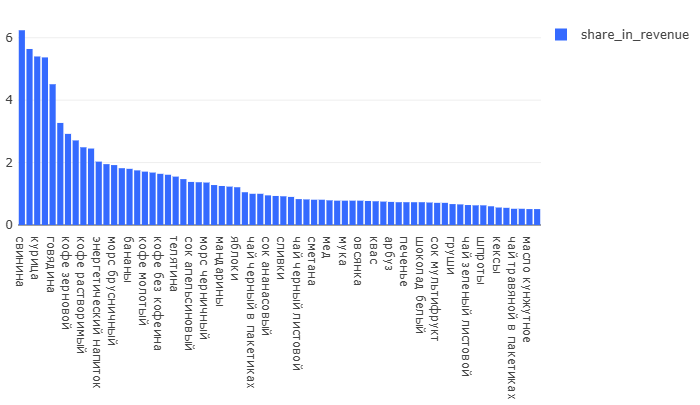

# 06 — Order Cancellation Loss

### Goal
Identify top-performing products and their contribution to overall revenue.

### Metrics
- `revenue` — total revenue per product
- `share_in_revenue` — product's percentage share of total revenue

### Insights
- Small number of products drive majority of revenue
- Long tail of products with minimal individual contribution
- Clear product winners with significant market preference

### Visualizations
- Product revenue distribution
- Revenue share by product category
- Top products vs "OTHER" category

