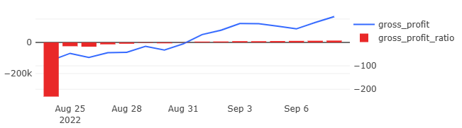
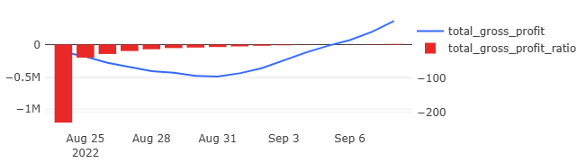

# 07 — Profit and Margin Analysis

### Goal
Calculate complete financial performance including costs, taxes, and profitability metrics.

### Metrics
- `revenue` — daily revenue
- `costs` — daily operational costs
- `tax` — VAT taxes
- `gross_profit` — revenue minus costs and taxes
- `total_*` — cumulative versions of all metrics
- `*_ratio` — profitability as percentage of revenue

### Insights
- Service reached profitability after initial investment period
- September cost optimizations improved gross margins
- Positive cumulative gross profit achieved after overcoming initial costs

### Visualizations
- Gross profit
- Total gross profit

